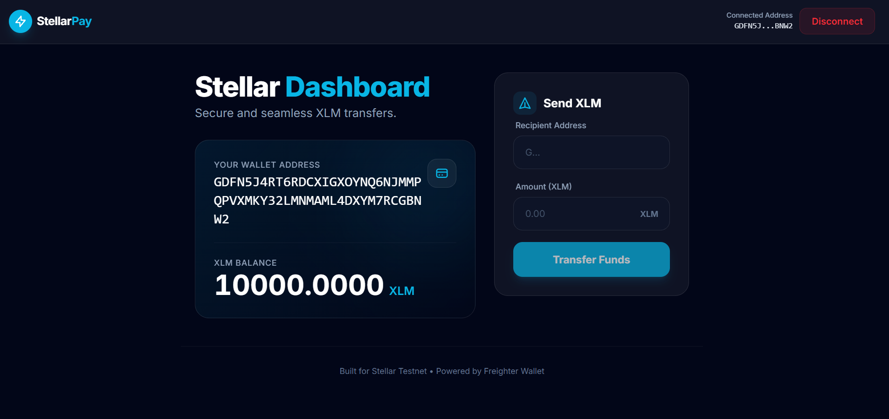
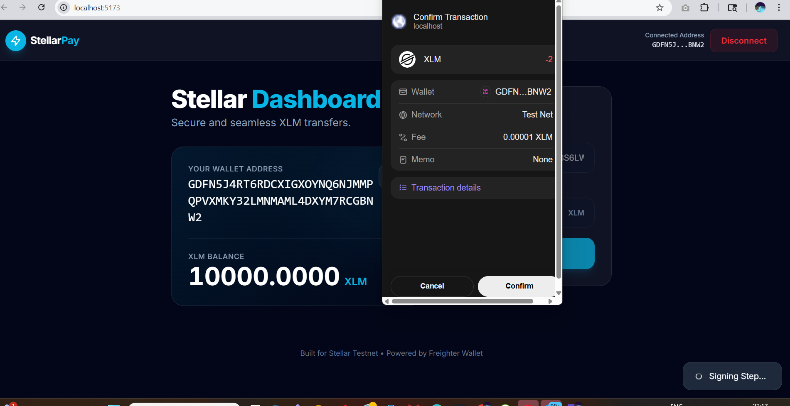
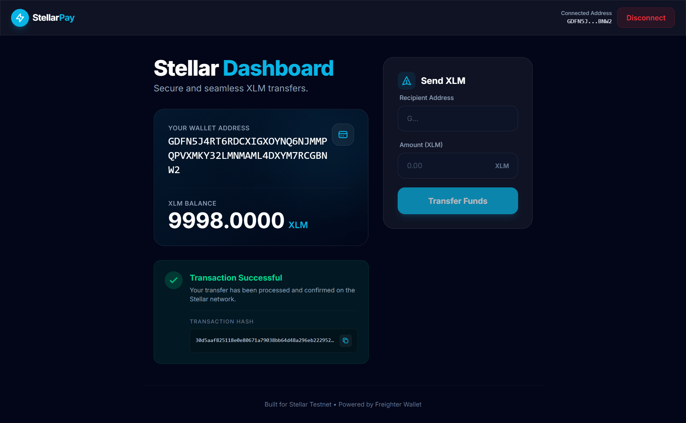
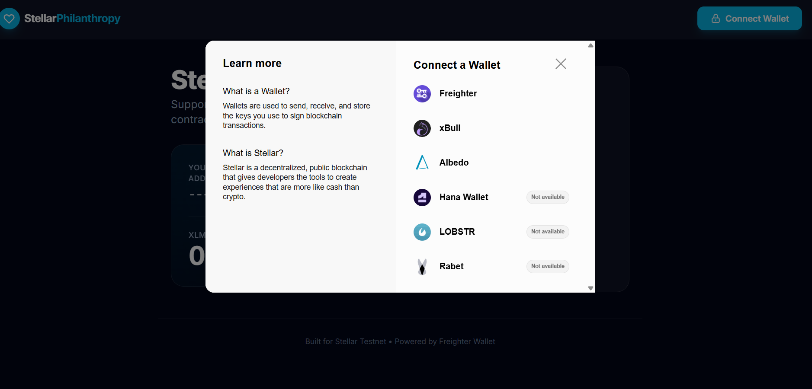
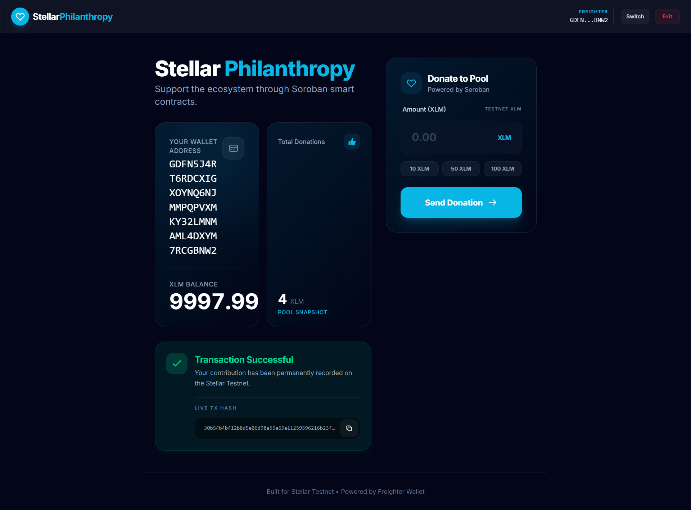
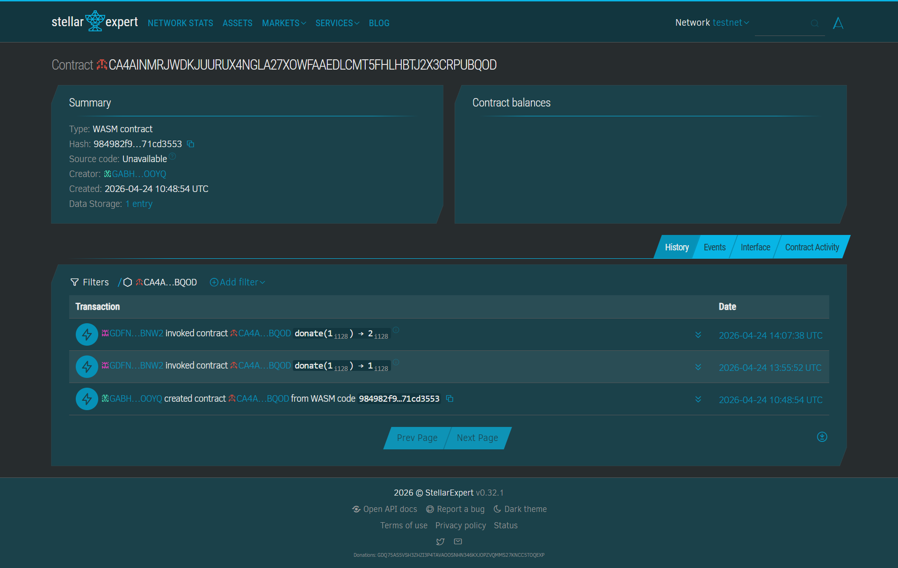
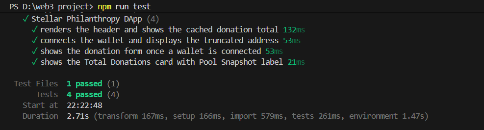
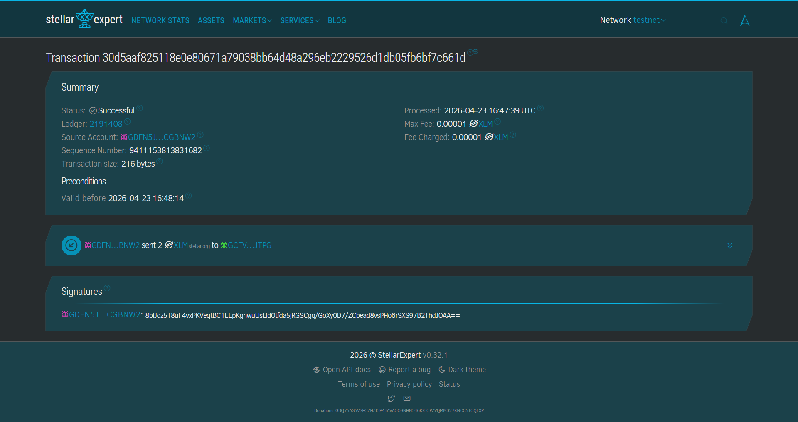

<div align="center">

# 🚀 Stellar Philanthropy

### A Multi-Wallet Donation dApp on the Stellar Blockchain

[](https://stellar.org)
[](https://vitejs.dev)
[](https://soroban.stellar.org)
[](https://vitest.dev)
[](https://stellarpay-lac.vercel.app/)

**A modern decentralized application (dApp) built on the Stellar Testnet that allows users to donate XLM using multiple wallets, powered by Soroban smart contracts — built across 3 progressive challenge levels.**

[🌐 Live Demo](https://stellarpay-lac.vercel.app/) &nbsp;·&nbsp; [🎬 Demo Video (Level 3)](https://drive.google.com/file/d/1sBxUY_Wt0idMdf0WuAeqn7IarSZYihaf/view?usp=sharing) &nbsp;·&nbsp; [📜 Smart Contract](https://stellar.expert/explorer/testnet/contract/CA4AINMRJWDKJUURUX4NGLA27XOWFAAEDLCMT5FHLHBTJ2X3CRPUBQOD) &nbsp;·&nbsp; [🔍 Sample Transaction](https://stellar.expert/explorer/testnet/tx/af5cb8470fa8e614a24b89bcb2e5eeb3a786768345f9300a5596d2bbbd217213)

</div>

---

## 📋 Table of Contents

- [Features by Level](#-features-by-level)
- [Smart Contract Details](#-smart-contract-details)
- [Screenshots](#-screenshots)
- [Test Results](#-test-results-level-3)
- [Tech Stack](#-tech-stack)
- [Setup Instructions](#-setup-instructions)
- [Project Structure](#-project-structure)
- [Author](#-author)

---

## ✨ Features by Level

### 🔹 Level 1 — Foundation

> Basic wallet connectivity and XLM transactions on Stellar Testnet.

| Feature | Status |
|--------|--------|
| 🔐 Connect Freighter wallet | ✅ |
| 💰 View live XLM balance | ✅ |
| 💸 Send XLM transactions | ✅ |
| ✅ Transaction success feedback | ✅ |

---

### 🔹 Level 2 — Smart Contract Integration

> Full Soroban smart contract deployment with multi-wallet support.

| Feature | Status |
|--------|--------|
| 🧠 Soroban smart contract deployed on Stellar Testnet | ✅ |
| 💸 Donate XLM via `donate` contract function | ✅ |
| 📊 View total donations via `get_total` | ✅ |
| 🔄 Real-time UI updates after each donation | ✅ |
| 🔐 Multi-wallet support (Freighter, xBull, Albedo) | ✅ |
| 📡 Transaction status indicators (Pending / Success / Failed) | ✅ |
| ⚠️ Error handling (wallet not found, rejected tx, low balance) | ✅ |

---

### 🔹 Level 3 — Enhancements & Quality

> Production-grade UX, testing, and full documentation.

| Feature | Status |
|--------|--------|
| ⏳ Loading states and progress indicators | ✅ |
| ⚡ Donation total caching with `localStorage` | ✅ |
| 🧪 Unit tests — 4 test cases, all passing | ✅ |
| 📊 Improved UI feedback on all interactions | ✅ |
| 🎬 Demo video showcasing full Level 3 workflow | ✅ |
| 📄 Comprehensive README with proofs for all levels | ✅ |

---

## 🧾 Smart Contract Details

| Property | Value |
|----------|-------|
| **Network** | Stellar Testnet |
| **Language** | Rust (compiled to WASM via Soroban) |
| **Functions** | `donate(amount)`, `get_total()` |
| **Contract Address** | `CA4AINMRJWDKJUURUX4NGLA27XOWFAAEDLCMT5FHLHBTJ2X3CRPUBQOD` |

🔗 **Verify Contract on Stellar Expert:**
https://stellar.expert/explorer/testnet/contract/CA4AINMRJWDKJUURUX4NGLA27XOWFAAEDLCMT5FHLHBTJ2X3CRPUBQOD

🔗 **Sample Transaction Hash (Level 2 Proof):**
```
af5cb8470fa8e614a24b89bcb2e5eeb3a786768345f9300a5596d2bbbd217213
```
https://stellar.expert/explorer/testnet/tx/af5cb8470fa8e614a24b89bcb2e5eeb3a786768345f9300a5596d2bbbd217213

---

## 📸 Screenshots

### 🔹 Level 1 — Wallet Connection & Transactions

<table>
  <tr>
    <td align="center">
      <strong>Wallet Connected</strong><br/>
      
    </td>
    <td align="center">
      <strong>Transaction Confirmation</strong><br/>
      
    </td>
    <td align="center">
      <strong>Transaction Success</strong><br/>
      
    </td>
  </tr>
</table>

> **Level 1 Proof:** Freighter wallet connected, XLM balance visible, transaction confirmed and succeeded on Stellar Testnet.

---

### 🔹 Level 2 — Smart Contract & Multi-Wallet

<table>
  <tr>
    <td align="center">
      <strong>Multi-Wallet Options</strong><br/>
      
    </td>
    <td align="center">
      <strong>Donation Success & Updated Total</strong><br/>
      
    </td>
    <td align="center">
      <strong>Contract Explorer Proof</strong><br/>
      
    </td>
  </tr>
</table>

> **Level 2 Proof:** Multi-wallet selector active (Freighter / xBull / Albedo), XLM donated via Soroban smart contract, total donations updated on-chain, contract verified on Stellar Expert.

---

### 🔹 Level 3 — Testing, UX & Stellar Expert Proof

<table>
  <tr>
    <td align="center">
      <strong>Unit Tests — All 4 Passing ✅</strong><br/>
      
    </td>
    <td align="center">
      <strong>Stellar Expert Explorer</strong><br/>
      
    </td>
  </tr>
</table>

> **Level 3 Proof:** All 4 unit tests pass — renders header, wallet connection, donation form, and total donations card. Loading states, `localStorage` caching, and improved UI feedback implemented. Full demo video linked above.

---

## 🧪 Test Results (Level 3)

Tests written with **Vitest** covering all core UI components:

```
✓ Stellar Philanthropy DApp (4)
  ✓ renders the header and shows the cached donation total    132ms
  ✓ connects the wallet and displays the truncated address     53ms
  ✓ shows the donation form once a wallet is connected         53ms
  ✓ shows the Total Donations card with Pool Snapshot label    21ms

Test Files   1 passed (1)
Tests        4 passed (4)
Duration     2.71s
```

Run tests locally:
```bash
npm run test
```

---

## 🛠️ Tech Stack

| Layer | Technology |
|-------|-----------|
| **Frontend** | React (Vite) |
| **Styling** | Tailwind CSS |
| **Blockchain SDK** | Stellar SDK |
| **Smart Contracts** | Soroban — Rust compiled to WASM |
| **Wallet Integration** | StellarWalletsKit (Freighter, xBull, Albedo) |
| **Testing** | Vitest |
| **Caching** | localStorage |
| **Deployment** | Vercel |

---

## ⚙️ Setup Instructions

### 1. Clone the Repository

```bash
git clone https://github.com/debdeepadutta/stellarpay.git
cd stellarpay
```

### 2. Install Dependencies

```bash
npm install
```

### 3. Run Locally

```bash
npm run dev
```

### 4. Run Tests

```bash
npm run test
```

### 5. Requirements

Before using the dApp, ensure you have:

- ✅ [Freighter](https://freighter.app/), [xBull](https://xbull.app/), or [Albedo](https://albedo.link/) wallet installed
- ✅ Wallet set to **Stellar Testnet** network
- ✅ Wallet funded via [Stellar Friendbot](https://friendbot.stellar.org/)

---

## 📁 Project Structure

```
stellarpay/
├── contracts/                  # Soroban smart contract (Rust)
│   ├── src/
│   │   └── lib.rs              # donate() and get_total() logic
│   └── Cargo.toml
├── src/                        # React frontend
│   └── App.jsx                 # Wallet connection, donation UI, contract calls
├── level_1_screenshots/        # Level 1 proof screenshots
│   ├── wallet_connected.png
│   ├── transaction_confirm.png
│   ├── transaction_success.png
│   └── stellar_expert.png
├── level_2_screenshots/        # Level 2 proof screenshots
│   ├── wallet_options.png
│   ├── donation_success.png
│   └── contract_proof.png
├── level_3_screenshots/        # Level 3 proof screenshots
│   └── test_cases.png
├── index.html
├── vite.config.js
├── package.json
└── .gitignore
```

---

## 📌 Challenge Journey Summary

| Level | Focus | Key Deliverable |
|-------|-------|-----------------|
| **Level 1** | Foundation | Freighter wallet + XLM send/receive on Testnet |
| **Level 2** | Smart Contracts | Soroban donation contract + multi-wallet support |
| **Level 3** | Quality & Polish | Unit tests, localStorage caching, UX improvements, demo video |

---

## 🙌 Author

**Debdeepa Dutta**

[](https://github.com/debdeepadutta)

---

<div align="center">
  <sub>Built with ❤️ on the Stellar Blockchain · Stellar Developer Program</sub>
</div>
