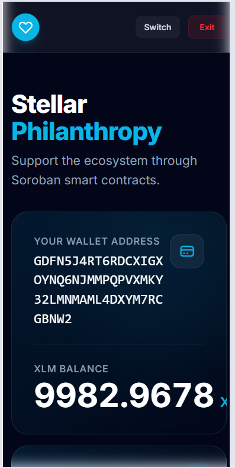
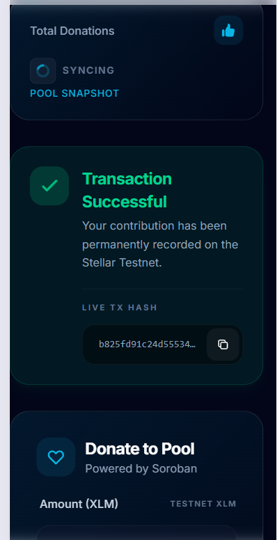
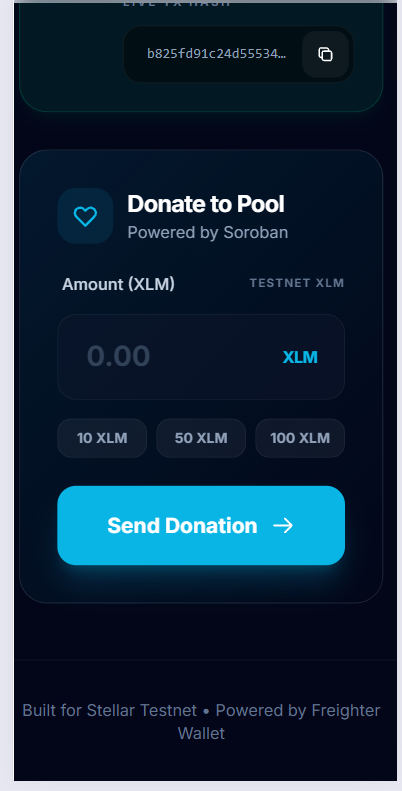
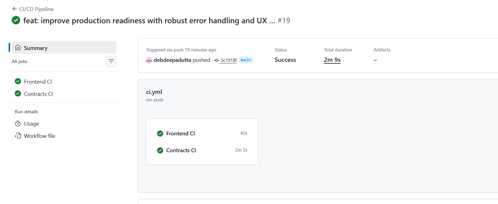
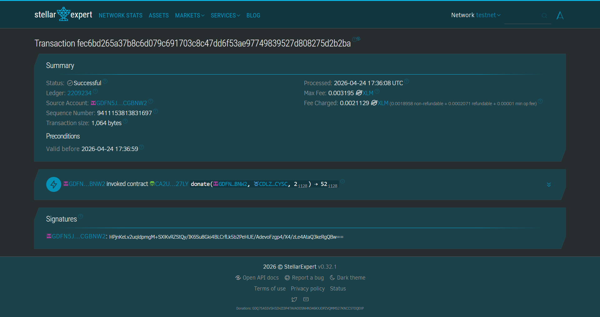

<div align="center">

# 🚀 Stellar Philanthropy

### A Production-Ready Multi-Wallet Donation dApp on Stellar + Soroban

[](https://stellar.org)
[](https://vitejs.dev)
[](https://soroban.stellar.org)
[](https://vitest.dev)
[](https://stellarpay-lac.vercel.app/)
[](https://github.com/debdeepadutta/stellarpay/actions/workflows/ci.yml)
[](https://github.com/debdeepadutta/stellarpay/actions/workflows/ci.yml)
[](https://github.com/debdeepadutta/stellarpay/actions/workflows/ci.yml)


**A decentralized philanthropy platform built on the Stellar Testnet, enabling XLM donations via Soroban smart contracts with multi-wallet support, inter-contract architecture, CI/CD automation, and a fully responsive mobile UI.**

[🌐 Live Demo](https://stellarpay-lac.vercel.app/) &nbsp;·&nbsp; [🎬 Demo Video](https://drive.google.com/file/d/1sBxUY_Wt0idMdf0WuAeqn7IarSZYihaf/view?usp=sharing) &nbsp;·&nbsp; [📜 Donation Contract](https://stellar.expert/explorer/testnet/contract/CA2UK75IFINHQYCMBYT7TXRMMHEP4FHYCFZOEHKGZOFTJBMI2AUT27LY) &nbsp;·&nbsp; [🔗 Inter-Contract Tx](https://stellar.expert/explorer/testnet/tx/52946283fa21abf0088129ed1ae1202d7cee05cc4383c4d0ba5a2628df1bf611)

</div>

---

## 📋 Table of Contents

- [Features by Level](#-features-by-level)
- [Smart Contract Details](#-smart-contract-details)
- [Screenshots](#-screenshots)
- [Test Results](#-test-results)
- [Tech Stack](#-tech-stack)
- [Setup Instructions](#-setup-instructions)
- [Project Structure](#-project-structure)
- [Author](#-author)

---

## ✨ Features by Level

### 🔹 Level 1 — Foundation

> Basic wallet connectivity and XLM transactions on Stellar Testnet.

| Feature | Status |
|--------|--------|
| 🔐 Connect Freighter wallet | ✅ |
| 💰 View live XLM balance | ✅ |
| 💸 Send XLM transactions | ✅ |
| ✅ Transaction success confirmation screen | ✅ |

---

### 🔹 Level 2 — Smart Contract Integration

> Full Soroban smart contract deployment with multi-wallet support.

| Feature | Status |
|--------|--------|
| 🧠 Soroban smart contract deployed on Stellar Testnet | ✅ |
| 💸 Donate XLM via `donate(amount)` contract function | ✅ |
| 📊 Fetch cumulative total via `get_total()` | ✅ |
| 🔄 Real-time UI updates after each donation | ✅ |
| 🔐 Multi-wallet support — Freighter, xBull, Albedo | ✅ |
| 📡 Transaction status indicators (Pending / Success / Failed) | ✅ |
| ⚠️ Error handling — wallet not found, rejected tx, low balance | ✅ |

---

### 🔹 Level 3 — Quality & Testing

> Production-grade UX, automated testing, and caching.

| Feature | Status |
|--------|--------|
| ⏳ Loading states and progress indicators | ✅ |
| ⚡ Donation total caching with `localStorage` | ✅ |
| 🧪 4 unit tests — all passing | ✅ |
| 📊 Improved UI feedback on all user interactions | ✅ |
| 🎬 Demo video walkthrough | ✅ |

---

### 🔹 Level 4 — Production Ready 🚀

> Inter-contract architecture, CI/CD automation, mobile responsiveness, and real-time sync.

| Feature | Status |
|--------|--------|
| 🔁 Inter-contract calls — Donation contract calls Logger contract | ✅ |
| ⚙️ CI/CD pipeline via GitHub Actions (install → test → build) | ✅ |
| 📱 Fully responsive mobile UI | ✅ |
| ⚡ Real-time polling with sync status indicator | ✅ |
| 🛡 Offline fallback using cached data | ✅ |
| 🔴 Error recovery for failed transactions | ✅ |

---

## 🧾 Smart Contract Details

| | Contract | Address |
|---|---|---|
| 💠 | **Donation Contract** | `CA2UK75IFINHQYCMBYT7TXRMMHEP4FHYCFZOEHKGZOFTJBMI2AUT27LY` |
| 📋 | **Logger Contract** | `CCQ5UK7SGAEBHOI4MHE2HC7TTGHKXRIIEBLUUD4CXIU5CPR4T2QUDVKW` |

- **Network:** Stellar Testnet
- **Language:** Rust → compiled to WASM via Soroban SDK
- **Functions:** `donate(amount)`, `get_total()`
- **Architecture:** The Donation contract internally invokes the Logger contract on every donation, demonstrating modular inter-contract design.

**Inter-Contract Transaction Hash:**
```
52946283fa21abf0088129ed1ae1202d7cee05cc4383c4d0ba5a2628df1bf611
```
🔗 [View on Stellar Expert](https://stellar.expert/explorer/testnet/tx/52946283fa21abf0088129ed1ae1202d7cee05cc4383c4d0ba5a2628df1bf611)

---

## 📸 Screenshots

### 🔹 Level 1 — Wallet Connection & XLM Transactions

<table>
  <tr>
    <td align="center">
      <strong>Wallet Connected</strong><br/>
      
    </td>
    <td align="center">
      <strong>Transaction Confirmation</strong><br/>
      
    </td>
    <td align="center">
      <strong>Transaction Success</strong><br/>
      
    </td>
  </tr>
</table>

<table>
  <tr>
    <td align="center">
      <strong>Verified on Stellar Expert</strong><br/>
      
    </td>
  </tr>
</table>

> ✅ **Level 1 Proof:** Freighter wallet connected, live XLM balance visible, transaction sent and confirmed on Stellar Testnet, verified on Stellar Expert explorer.

---

### 🔹 Level 2 — Smart Contract & Multi-Wallet

<table>
  <tr>
    <td align="center">
      <strong>Multi-Wallet Selector</strong><br/>
      
    </td>
    <td align="center">
      <strong>Donation Success & Total Updated</strong><br/>
      
    </td>
    <td align="center">
      <strong>Contract Explorer Proof</strong><br/>
      
    </td>
  </tr>
</table>

> ✅ **Level 2 Proof:** Multi-wallet selector active (Freighter / xBull / Albedo), XLM donated via Soroban contract, on-chain total updated in real time, contract verified on Stellar Expert.

---

### 🔹 Level 3 — Testing & UX

<table>
  <tr>
    <td align="center">
      <strong>Unit Tests — All 4 Passing ✅</strong><br/>
      
    </td>
  </tr>
</table>

> ✅ **Level 3 Proof:** 4 unit tests pass covering header render, wallet connection, donation form, and total donations card. Loading states, caching, and UI feedback fully implemented.

---

### 🔹 Level 4 — Production Features

**📱 Mobile Responsive Views**

<table>
  <tr>
    <td align="center">
      <strong>Mobile — Wallet Connect</strong><br/>
      
    </td>
    <td align="center">
      <strong>Mobile — Donation Flow</strong><br/>
      
    </td>
    <td align="center">
      <strong>Mobile — Transaction Result</strong><br/>
      
    </td>
  </tr>
</table>

**⚙️ CI/CD Pipeline**

<table>
  <tr>
    <td align="center">
      
    </td>
  </tr>
</table>

**🔁 Inter-Contract Execution**

<table>
  <tr>
    <td align="center">
      
    </td>
  </tr>
</table>

> ✅ **Level 4 Proof:** Fully responsive on mobile, GitHub Actions pipeline runs on every push (install → test → build), Donation contract calls Logger contract internally as shown on Stellar Expert.

---

## 🧪 Test Results

Tests written with **Vitest**, covering all core UI components:

```
✓ Stellar Philanthropy DApp (4)
  ✓ renders the header and shows the cached donation total    132ms
  ✓ connects the wallet and displays the truncated address     53ms
  ✓ shows the donation form once a wallet is connected         53ms
  ✓ shows the Total Donations card with Pool Snapshot label    21ms

Test Files   1 passed (1)
Tests        4 passed (4)
Duration     2.71s
```

Run tests locally:

```bash
npm run test
```

---

## 🛠️ Tech Stack

| Layer | Technology |
|-------|-----------|
| **Frontend** | React (Vite) |
| **Styling** | Tailwind CSS |
| **Blockchain SDK** | Stellar SDK |
| **Smart Contracts** | Soroban — Rust compiled to WASM |
| **Wallet Integration** | StellarWalletsKit (Freighter, xBull, Albedo) |
| **Testing** | Vitest |
| **CI/CD** | GitHub Actions |
| **Caching** | localStorage |
| **Deployment** | Vercel |

---

## ⚙️ Setup Instructions

### 1. Clone the Repository

```bash
git clone https://github.com/debdeepadutta/stellarpay.git
cd stellarpay
```

### 2. Install Dependencies

```bash
npm install
```

### 3. Run Locally

```bash
npm run dev
```

### 4. Run Tests

```bash
npm run test
```

### 5. Prerequisites

Before using the dApp, ensure:

- ✅ [Freighter](https://freighter.app/), [xBull](https://xbull.app/), or [Albedo](https://albedo.link/) wallet extension installed
- ✅ Wallet network set to **Stellar Testnet**
- ✅ Wallet funded via [Stellar Friendbot](https://friendbot.stellar.org/)

---

## 📁 Project Structure

```
stellarpay/
├── contracts/                    # Soroban smart contracts (Rust)
│   ├── donation_contract/
│   │   └── src/lib.rs            # donate() and get_total() logic
│   └── logger_contract/          # Logger contract (called by donation contract)
├── src/                          # React frontend
│   └── App.jsx                   # Wallet connection, donation UI, contract calls
├── level_1_screenshots/          # Level 1 proof screenshots
│   ├── wallet_connected.png
│   ├── transaction_confirm.png
│   ├── transaction_success.png
│   └── stellar_expert.png
├── level_2_screenshots/          # Level 2 proof screenshots
│   ├── wallet_options.png
│   ├── donation_success.png
│   └── contract_proof.png
├── level_3_screenshots/          # Level 3 proof screenshots
│   └── test_cases.png
├── level_4_screenshots/          # Level 4 proof screenshots
│   ├── ci_cd.png
│   ├── inter_contract.png
│   ├── mobile_view_1.png
│   ├── mobile_view_2.png
│   └── mobile_view_3.png
├── .github/workflows/ci.yml      # GitHub Actions CI/CD pipeline
├── index.html
├── vite.config.js
├── package.json
└── README.md
```

---

## 📌 Challenge Journey

| Level | Focus | Key Deliverable |
|-------|-------|----------------|
| **Level 1** | Foundation | Freighter wallet + XLM send/receive on Testnet |
| **Level 2** | Smart Contracts | Soroban donation contract + multi-wallet support |
| **Level 3** | Quality & Polish | Unit tests, `localStorage` caching, UX improvements |
| **Level 4** | Production Ready | Inter-contract calls, CI/CD, mobile UI, real-time sync |

---

## 🙌 Author

**Debdeepa Dutta**

[](https://github.com/debdeepadutta)

---

<div align="center">
  <sub>Built with ❤️ on the Stellar Blockchain · Stellar Developer Program</sub>
</div>
