<div align="center">


# Stellar Philanthropy

### A Decentralized Philanthropy Marketplace on Stellar + Soroban

[](https://stellar.org)
[](https://vitejs.dev)
[](https://soroban.stellar.org)
[](https://firebase.google.com)
[-00C853?style=for-the-badge)](https://webauthn.io)
[](https://vitest.dev)
[](https://stellarpay-lac.vercel.app/)
[](https://github.com/debdeepadutta/stellarpay/actions/workflows/ci.yml)

**A production-ready decentralized philanthropy marketplace built on the Stellar blockchain using Soroban smart contracts. Admins launch fundraising campaigns on-chain. Donors browse a global marketplace, contribute XLM — either via a traditional wallet or a completely gasless, seedless Passkey smart wallet — and track impact in real time, across a five-contract on-chain ecosystem with no central authority.**

[🌐 Live Demo](https://stellarpay-lac.vercel.app/) &nbsp;·&nbsp;
[🎬 Demo Video (Level 1–4)](https://drive.google.com/file/d/195XyArDZfn1T8xCJH_gzOuPSLEE86IdA/view?usp=sharing) &nbsp;·&nbsp;
[🎬 Demo Video (Level 5)](https://canva.link/ml4qkgjho56hxwf) &nbsp;·&nbsp;
[📊 Pitch Deck](https://drive.google.com/file/d/124hZlms0_7vy7vqZgTcp-i4ulqXXTnWv/view?usp=sharing) &nbsp;·&nbsp;
[📜 Campaign Hub Contract](https://stellar.expert/explorer/testnet/contract/CDBBFKGIDPUV65CYN75XOZYCNSACIQ2Z7NI2NB6R5NZCTFZ2PG52WOSM) &nbsp;·&nbsp;
[🔗 Inter-Contract Tx](https://stellar.expert/explorer/testnet/tx/65c2af62d4160528de7342f7dc9df35a122999c06aba78f12a944b090ad493d3)

</div>

---

## 📋 Table of Contents

- [Architecture](#-architecture)
- [Features by Level](#-features-by-level)
- [Smart Contract Details](#-smart-contract-details)
- [Screenshots](#-screenshots)
- [Level 5 — Growth, Onboarding & Product Iteration](#-level-5--growth-onboarding--product-iteration)
  - [User Growth & Onboarding](#user-growth--onboarding)
  - [Real Transaction Activity](#real-transaction-activity)
  - [Product Improvements & Feedback-Driven Roadmap](#product-improvements--feedback-driven-roadmap)
  - [Product Presentation](#product-presentation)
- [Test Results](#-test-results)
- [Tech Stack](#-tech-stack)
- [Setup Instructions](#-setup-instructions)
- [Project Structure](#-project-structure)
- [Submission Checklist](#-submission-checklist)
- [Author](#-author)

---

## 🏛️ Architecture

```
┌─────────────────────────────────────────────────────────────┐
│                        FRONTEND (React)                     │
│                                                             │
│   Landing → Admin Portal          Landing → Donor Portal    │
│   ├── Create Campaign             ├── Campaign Marketplace  │
│   ├── Manage Vault                ├── Campaign Details      │
│   ├── View Analytics              ├── Donate XLM            │
│   └── Delete Campaigns            ├── Leaderboard           │
│                                   ├── Live Feed              │
│                                   └── Impact Receipts (SBT)  │
│                                                              │
│   Onboarding Gateway: Extension Wallet OR Passkey Smart     │
│   Wallet (Face ID / Touch ID, gasless, seedless)            │
└────────────────────────┬────────────────────────────────────┘
                         │
          ┌──────────────▼──────────────┐
          │     Firebase Firestore      │  ← Campaign metadata
          │   (name, description, goal) │     global persistence
          └──────────────┬──────────────┘
                         │
          ┌──────────────▼──────────────┐
          │      Horizon SSE Stream     │  ← Real-time events
          └──────────────┬──────────────┘
                         │
          ┌──────────────▼──────────────┐
          │       DONATION CONTRACT     │
          │  donate() │ get_total()     │
          │  create_campaign()          │
          │  get_campaign_info()        │
          │  get_campaign_admin()       │
          └──────┬──────┬───────┬───────┘
                 │      │       │
     inter-contract calls       │
                 │      │       │
     ┌───────────▼─┐ ┌──▼─────┐ ┌▼───────────────┐
     │   LOGGER    │ │ VAULT  │ │  SBT / IMPACT   │
     │  CONTRACT   │ │CONTRACT│ │ RECEIPT CONTRACT│
     │             │ │        │ │                 │
     │log_donation()│ │deposit()│ │ mint_receipt() │
     │get_history() │ │withdraw()│ │ get_receipt()  │
     │get_recent()  │ │get_stats()│ │(non-transferable)│
     └─────────────┘ └────────┘ └─────────────────┘

          ┌───────────────────────────────┐
          │   SMART WALLET FACTORY         │  ← Gasless / seedless
          │   register_passkey()           │     onboarding via
          │   deploy_smart_wallet()        │     WebAuthn Passkeys
          └─────────────────────────────────┘
```

### What Lives Where

| Data | Storage | Reason |
|---|---|---|
| Campaign admin, goal, total raised | On-chain (Soroban) | Security-critical, tamper-proof |
| Vault balances per campaign | On-chain (Soroban) | Financial state |
| Donation history + events | On-chain (Logger) | Audit trail |
| Donor Impact Receipts (SBTs) | On-chain (SBT Contract) | Non-transferable proof of contribution |
| Passkey → wallet address mapping | On-chain (Smart Wallet Factory) | Gasless, seedless onboarding |
| Campaign name, description | Firebase Firestore | Rich metadata, cheaper off-chain |
| Real-time updates | Horizon SSE | Native Stellar streaming |
| Donor survey / feedback responses | Google Form → Excel export | Product iteration & growth tracking |

---

## ✨ Features by Level

### 🔹 Level 1 — Foundation

> Basic wallet connectivity and XLM transactions on Stellar Testnet.

| Feature | Status |
|--------|--------|
| 🔐 Connect Freighter wallet | ✅ |
| 💰 View live XLM balance | ✅ |
| 💸 Send XLM transactions | ✅ |
| ✅ Transaction success confirmation | ✅ |

---

### 🔹 Level 2 — Smart Contract Integration

> Full Soroban smart contract deployment with multi-wallet support.

| Feature | Status |
|--------|--------|
| 🧠 Soroban smart contract deployed on Stellar Testnet | ✅ |
| 💸 Donate XLM via `donate()` contract function | ✅ |
| 📊 Fetch cumulative total via `get_total()` | ✅ |
| 🔄 Real-time UI updates after each donation | ✅ |
| 🔐 Multi-wallet — Freighter, xBull, Albedo | ✅ |
| 📡 Transaction status indicators (Pending / Success / Failed) | ✅ |
| ⚠️ Error handling — wallet not found, rejected tx, low balance | ✅ |

---

### 🔹 Level 3 — Quality & Testing

> Production-grade UX, automated testing, and caching.

| Feature | Status |
|--------|--------|
| ⏳ Loading states and progress indicators | ✅ |
| ⚡ Donation total caching with `localStorage` | ✅ |
| 🧪 4 unit tests — all passing | ✅ |
| 📊 Improved UI feedback on all interactions | ✅ |
| 🎬 Demo video walkthrough | ✅ |

---

### 🔹 Level 4 — Production Ready

> Three-contract ecosystem, dual-portal marketplace, Firebase + blockchain hybrid, CI/CD pipeline.

| Feature | Status |
|--------|--------|
| 🏛️ Dual-portal architecture — Admin + Donor | ✅ |
| 🔁 Three-contract inter-contract ecosystem | ✅ |
| 🏪 Global campaign marketplace via Firebase Firestore | ✅ |
| 🔐 On-chain admin verification per campaign | ✅ |
| 💰 Per-campaign isolated vault balances | ✅ |
| 📋 Logger contract — full queryable donation history | ✅ |
| 🔗 Deep linking — shareable campaign URLs | ✅ |
| 📣 OG meta tags for social sharing (X, LinkedIn) | ✅ |
| ⚡ Horizon SSE real-time streaming | ✅ |
| 🧪 7 Rust contract-level tests (2 unit + 5 integration) | ✅ |
| ⚙️ CI/CD — contract compile + test + deploy pipeline | ✅ |
| 🛡️ Security scan — no hardcoded secrets in CI | ✅ |
| 📱 Fully responsive mobile UI | ✅ |
| 🔴 Error recovery for failed transactions | ✅ |

---

### 🔹 Level 5 — Growth, Gasless Onboarding & Product Iteration 🚀

> Passkey smart wallets, Soul-Bound impact receipts, gamified reputation, real user growth, and a feedback-driven roadmap.

| Feature | Status |
|--------|--------|
| 🪪 Gasless, seedless onboarding via WebAuthn Passkeys (Face ID / Touch ID) | ✅ |
| 🏭 Smart Wallet Factory contract — deploys a Soroban smart wallet per passkey | ✅ |
| 🖊️ Passkey transaction signing (no browser-extension popup required) | ✅ |
| 🎟️ Soul-Bound Impact Receipts (SBT) minted per donation | ✅ |
| 🏆 Donor Leaderboard with live contribution-weight ranking | ✅ |
| 🎮 Reputation / badge system (e.g. "Champion" tier) | ✅ |
| 📡 Live Soroban Event Stream feed on campaign pages | ✅ |
| 👑 Admin Terminal — global platform metrics across all campaigns | ✅ |
| 📝 Google Form user-onboarding survey (wallet, email, name, feedback rating) | ✅ |
| 📈 50 testnet users onboarded — real transaction activity | ✅ |
| 🔁 Feedback-driven improvement log with linked commits | ✅ |
| 📊 Pitch deck covering problem, solution, market, architecture, growth & roadmap | ✅ |

---

## 🧾 Smart Contract Details

| | Contract | Address | Explorer |
|---|---|---|---|
| 💠 | **Campaign Hub Contract** | `CDBBFKGIDPUV65CYN75XOZYCNSACIQ2Z7NI2NB6R5NZCTFZ2PG52WOSM` | [View Activity](https://stellar.expert/explorer/testnet/contract/CDBBFKGIDPUV65CYN75XOZYCNSACIQ2Z7NI2NB6R5NZCTFZ2PG52WOSM) |
| 📋 | **Logger Contract** | `CDIK5KV222V3SJPN45PIYZEZ3EFI6QLNA5DAGFDAIZUMG5K3M53IX6LS` | [View Activity](https://stellar.expert/explorer/testnet/contract/CDIK5KV222V3SJPN45PIYZEZ3EFI6QLNA5DAGFDAIZUMG5K3M53IX6LS) |
| 🏦 | **Vault Contract** | `CBN2ZBV5ZRDDHVC4EGEW3UI7X2XZ3XWXGJYXW3ADY7KDD2APR3MGWPEI` | [View Activity](https://stellar.expert/explorer/testnet/contract/CBN2ZBV5ZRDDHVC4EGEW3UI7X2XZ3XWXGJYXW3ADY7KDD2APR3MGWPEI) |
| 🎟️ | **SBT / Impact Receipt Contract** | `CCCL7PJGJEYGTICSK4S3TU2M5HMCH3PHKMUEALVDYII6MDJN2DDFVEKT` | [View Activity](https://stellar.expert/explorer/testnet/contract/CCCL7PJGJEYGTICSK4S3TU2M5HMCH3PHKMUEALVDYII6MDJN2DDFVEKT) |
| 🏭 | **Smart Wallet Factory Contract** | `CDZL737THBVBCO443UXGXCFF4Z3JQNFAKRZXZNIPMF3FG4IDDTMDP6KP` | [View Activity](https://stellar.expert/explorer/testnet/contract/CDZL737THBVBCO443UXGXCFF4Z3JQNFAKRZXZNIPMF3FG4IDDTMDP6KP) |

- **Network:** Stellar Testnet
- **Language:** Rust → compiled to WASM via Soroban SDK
- **Deploy Date (Campaign Hub, Logger, Vault — current):** 2026-06-02 (redeployed as part of Level 5 milestone-based vault upgrade)
- **Deploy Date (SBT / Impact Receipt Contract):** 2026-07-17
- **Deploy Date (Smart Wallet Factory):** 2026-07-17

> 🔍 **Verify it yourself:** don't just trust the UI — check the cryptographic ledger. Open any contract link above, click the **"Events"** or **"Invocations"** tab on Stellar Expert, and you'll see the complete chronological history of every donation, milestone-gated withdrawal, receipt mint, and smart wallet deployment, executed exactly according to the on-chain rules.

### Contract Functions

| Contract | Functions |
|---|---|
| **Donation / Campaign Hub** | `create_campaign()`, `donate()`, `get_total()`, `get_campaign_info()`, `get_campaign_admin()`, `get_campaign_total()` |
| **Logger** | `log_donation()`, `get_all_donations()`, `get_donor_history()`, `get_recent_donations()`, `get_donation_count()` |
| **Vault** | `deposit()`, `withdraw()`, `get_balance()`, `get_campaign_stats()`, `get_withdrawal_history()` |
| **SBT / Impact Receipt** | `mint_receipt()`, `get_receipt()`, `get_receipts_by_donor()` (non-transferable by design) |
| **Smart Wallet Factory** | `deploy()` — creates a new smart wallet contract bound to a passkey public key, `initialize()`, `get_wallet_by_passkey()` |

### How One Donation Works — Atomic Transaction

```
Donor clicks "Send Donation"
         ↓
Donation Contract: donate(campaign_id, donor, amount)
         ↓                    ↓                    ↓
Logger Contract          Vault Contract         SBT Contract
log_donation()           deposit(campaign_id,    mint_receipt(donor,
         ↓                amount)                 campaign_id, amount)
On-chain audit trail     Funds held securely     Non-transferable
         ↓                                        Impact Receipt
Single atomic transaction — all or nothing
```

**Inter-Contract Transaction Hash:**
```
65c2af62d4160528de7342f7dc9df35a122999c06aba78f12a944b090ad493d3
```
🔗 [View on Stellar Expert](https://stellar.expert/explorer/testnet/tx/65c2af62d4160528de7342f7dc9df35a122999c06aba78f12a944b090ad493d3)

### How a Passkey Smart Wallet Is Created

```
User clicks "Quick Start (Smart Wallet)"
         ↓
Enters username / alias (maps to local passkey identity)
         ↓
Browser/OS WebAuthn prompt → user registers a passkey
   (Face ID / Touch ID / security key)
         ↓
Smart Wallet Factory: deploy(passkey_public_key, salt)
         ↓
New Soroban smart contract wallet created on Testnet
         ↓
User is assigned a permanent on-chain address,
fully controlled by the registered passkey — no seed phrase ever seen
```

---

## 📸 Screenshots

### 🔹 Level 1 — Wallet Connection & XLM Transactions

<table>
  <tr>
    <td align="center">
      <strong>Wallet Connected</strong><br/>
      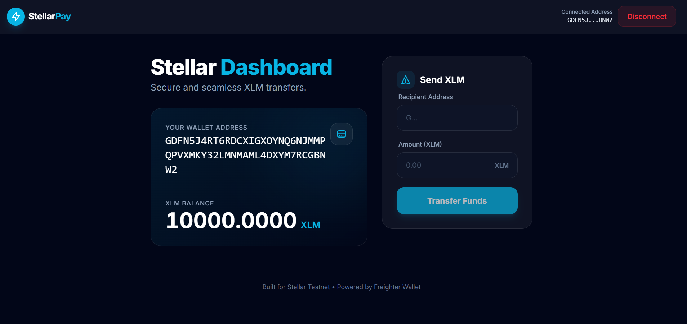
    </td>
    <td align="center">
      <strong>Transaction Confirmation</strong><br/>
      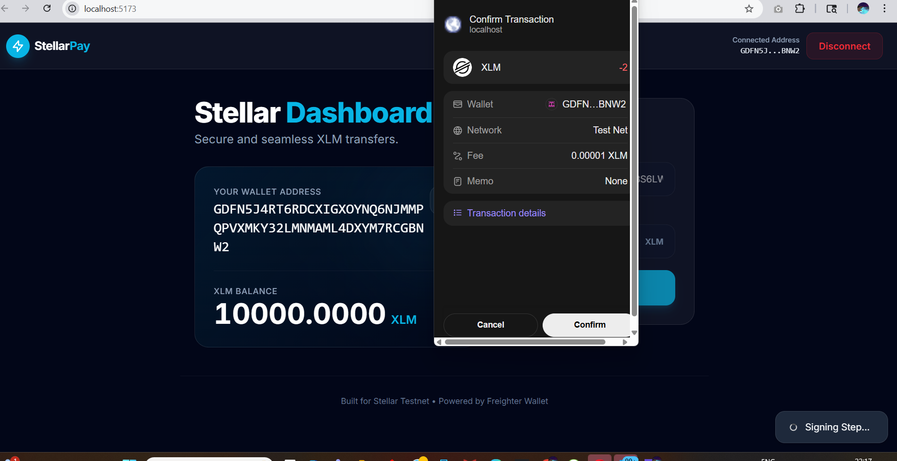
    </td>
    <td align="center">
      <strong>Transaction Success</strong><br/>
      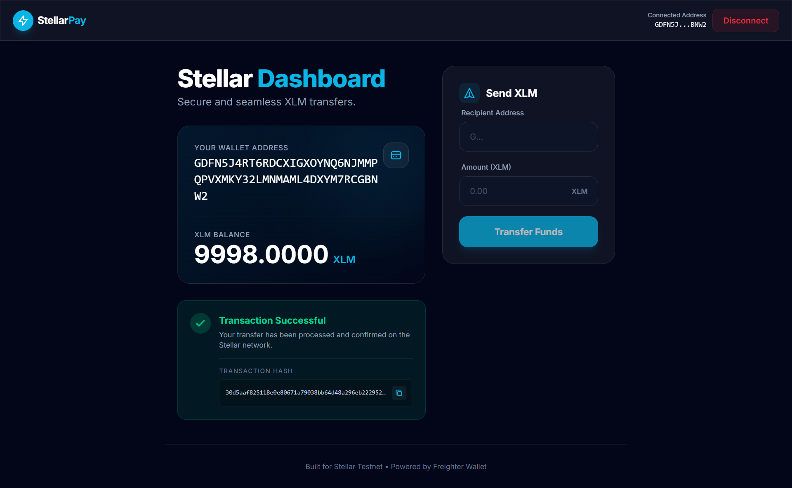
    </td>
  </tr>
</table>

<table>
  <tr>
    <td align="center">
      <strong>Verified on Stellar Expert</strong><br/>
      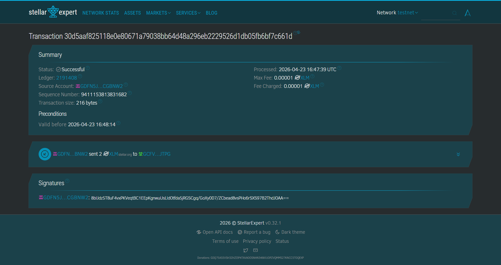
    </td>
  </tr>
</table>

> ✅ **Level 1 Proof:** Freighter wallet connected, live XLM balance visible, transaction confirmed on Stellar Testnet, verified on Stellar Expert.

---

### 🔹 Level 2 — Smart Contract & Multi-Wallet

<table>
  <tr>
    <td align="center">
      <strong>Multi-Wallet Selector</strong><br/>
      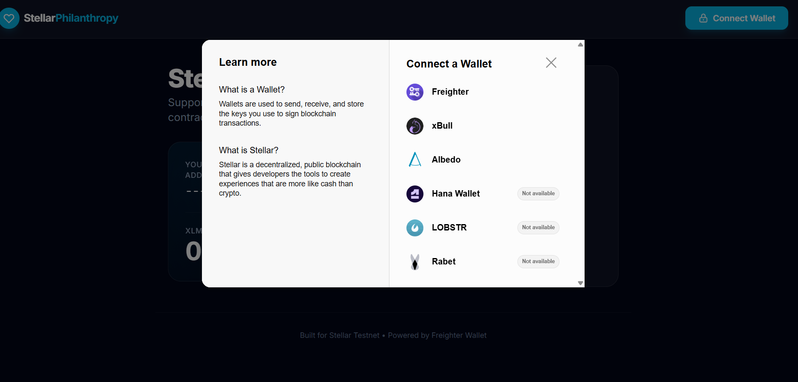
    </td>
    <td align="center">
      <strong>Donation Success</strong><br/>
      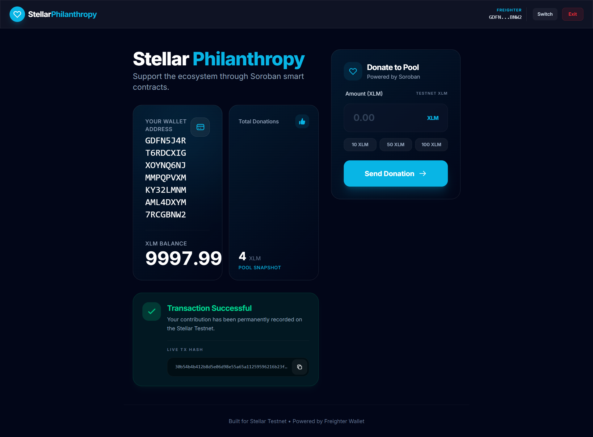
    </td>
    <td align="center">
      <strong>Contract Explorer Proof</strong><br/>
      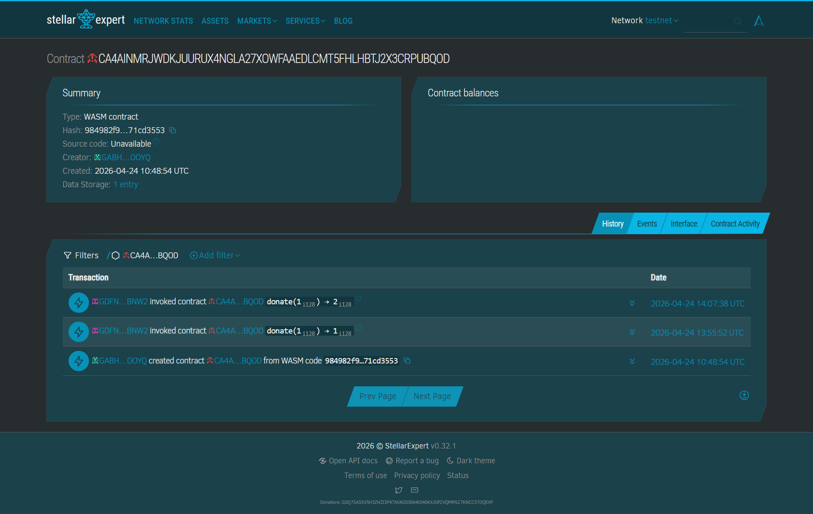
    </td>
  </tr>
</table>

> ✅ **Level 2 Proof:** Multi-wallet selector active (Freighter / xBull / Albedo), XLM donated via Soroban contract, on-chain total updated in real time.

---

### 🔹 Level 3 — Testing & UX

<table>
  <tr>
    <td align="center">
      <strong>Unit Tests — All 4 Passing ✅</strong><br/>
      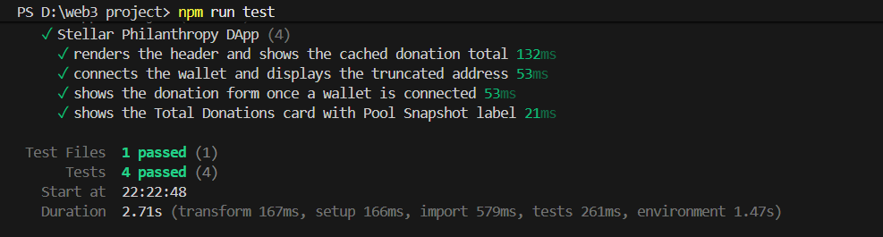
    </td>
  </tr>
</table>

> ✅ **Level 3 Proof:** 4 Vitest unit tests passing covering landing page, wallet connection, marketplace navigation, and admin portal.

---

### 🔹 Level 4 — Production Features

**🏛️ Landing Page — Portal Selection**

<table>
  <tr>
    <td align="center">
      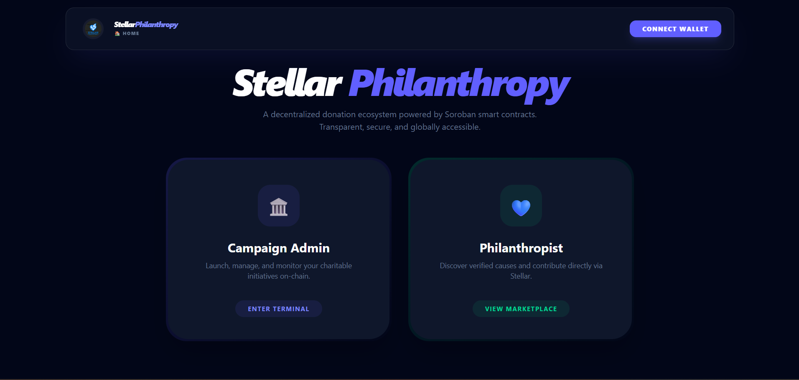
    </td>
  </tr>
</table>

**👑 Admin Portal — Campaign Management**

<table>
  <tr>
    <td align="center">
      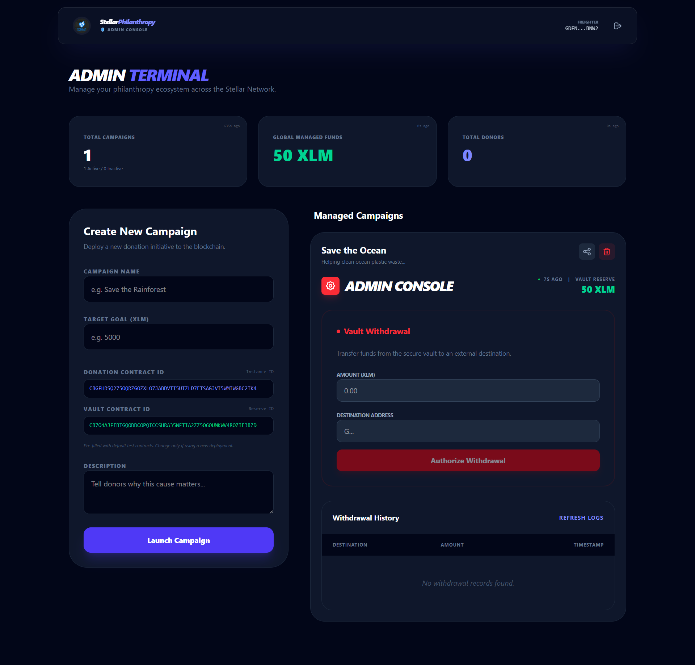
    </td>
  </tr>
</table>

**💙 Donor Portal — Campaign Marketplace & Details**

<table>
  <tr>
    <td align="center">
      <strong>Campaign Marketplace — Browse All Campaigns</strong><br/>
      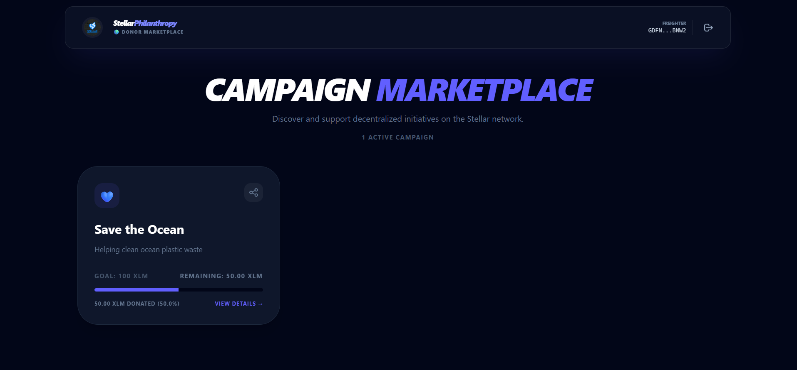
    </td>
  </tr>
</table>

<table>
  <tr>
    <td align="center">
      <strong>Campaign Details — Donate + Leaderboard + Live Feed</strong><br/>
      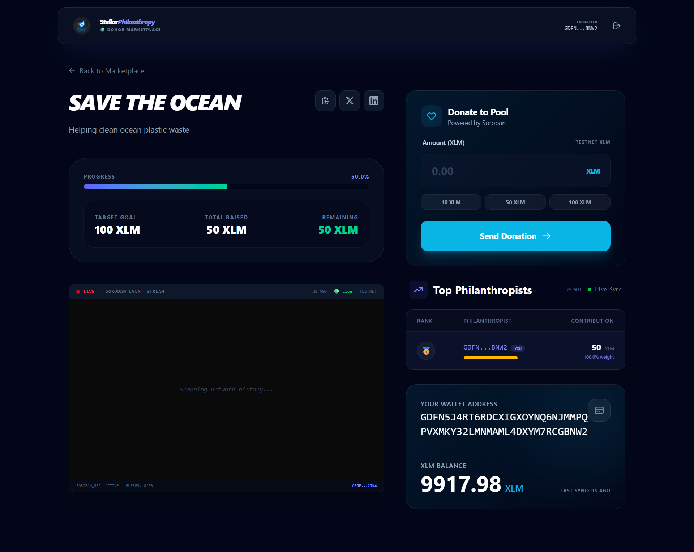
    </td>
  </tr>
</table>

**🔁 Inter-Contract Atomic Transaction on Stellar Expert**

<table>
  <tr>
    <td align="center">
      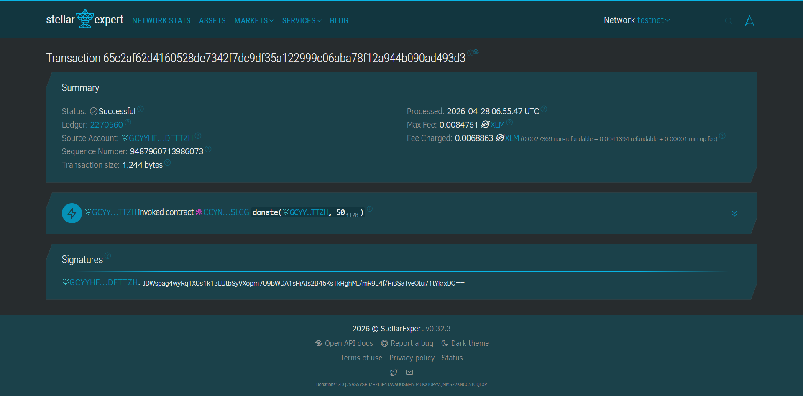
    </td>
  </tr>
</table>

**📱 Mobile Responsive — Landing Page**

<table>
  <tr>
    <td align="center">
      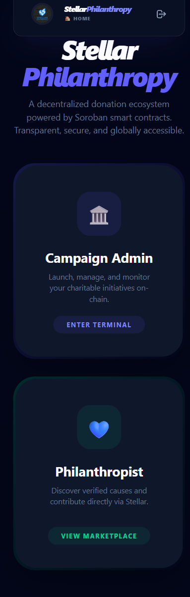
    </td>
  </tr>
</table>

**📱 Mobile Responsive — Admin Portal**

<table>
  <tr>
    <td align="center">
      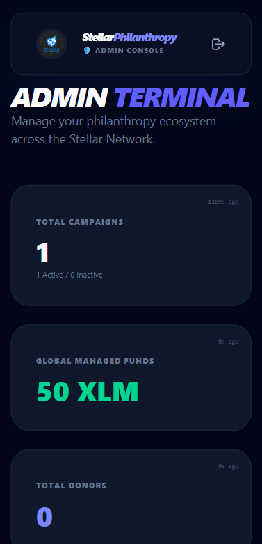
    </td>
    <td align="center">
      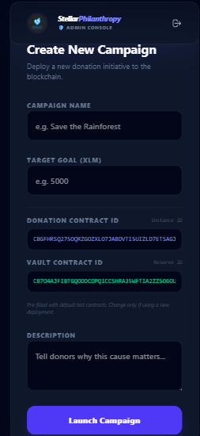
    </td>
    <td align="center">
      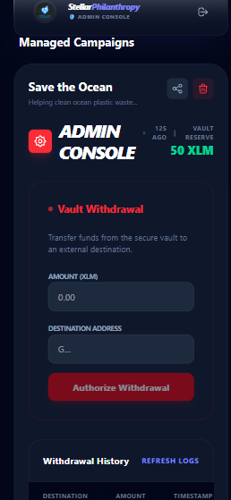
    </td>
  </tr>
</table>

**📱 Mobile Responsive — Donor Portal**

<table>
  <tr>
    <td align="center">
      <strong>Donor Marketplace</strong><br/>
      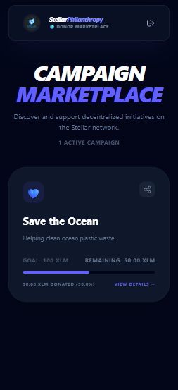
    </td>
    <td align="center">
      <strong>Campaign Details Part 1</strong><br/>
      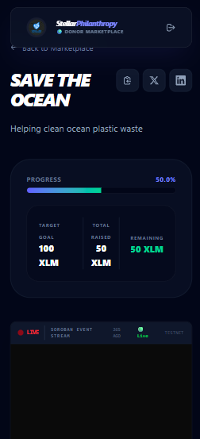
    </td>
    <td align="center">
      <strong>Campaign Details Part 2</strong><br/>
      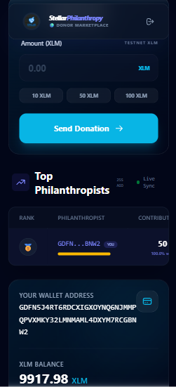
    </td>
  </tr>
</table>

> ✅ **Level 4 Proof:** Dual-portal architecture, global Firebase marketplace, 3-contract ecosystem, atomic inter-contract transactions, deep linking, Horizon SSE streaming, 7 Rust tests, full CI/CD pipeline, fully responsive on all devices.

---

### 🔹 Level 5 — Passkey Onboarding, Impact Receipts & Growth

**1. The Onboarding Gateway**

<table>
  <tr>
    <td align="center">
      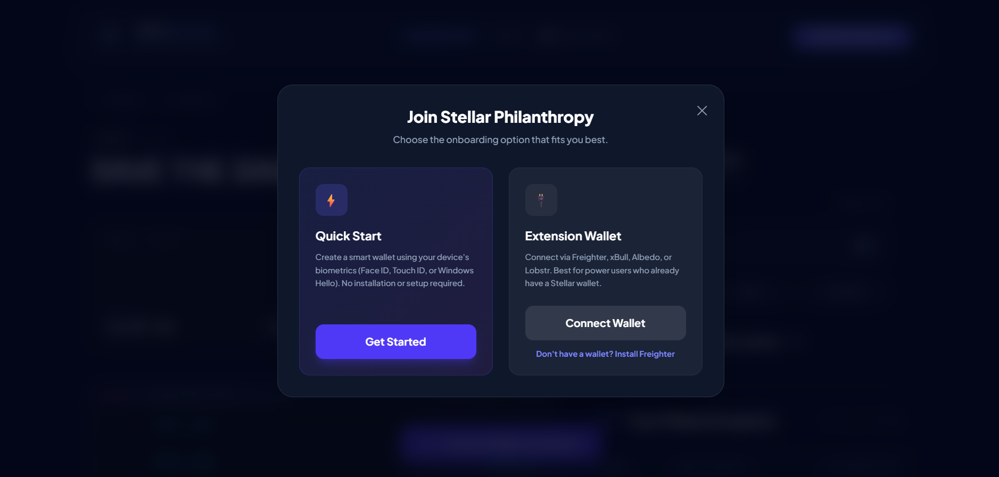
    </td>
  </tr>
</table>

The user flow begins with the **"Join Stellar Philanthropy"** modal, offering a choice between **Quick Start (Smart Wallet)** — instant onboarding via device biometrics, no extension needed — and **Extension Wallet** for existing Freighter / xBull / Albedo users.

**2. Passkey Account Creation**

<table>
  <tr>
    <td align="center">
      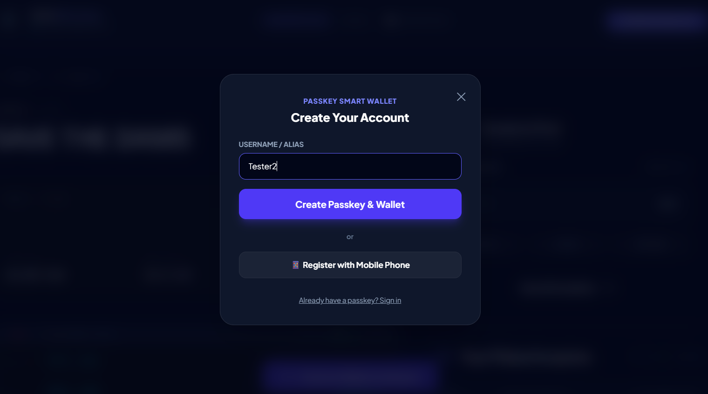
    </td>
  </tr>
</table>

The user selects "Quick Start" and enters a simple `USERNAME / ALIAS`, abstracting away 56-character secret keys entirely.

**3. WebAuthn Passkey Registration**

<table>
  <tr>
    <td align="center">
      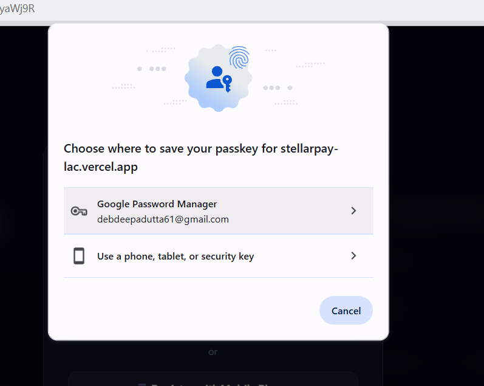
    </td>
  </tr>
</table>

Clicking "Create Passkey & Wallet" triggers the native browser/OS WebAuthn prompt, letting the user securely register their credential via Face ID, Touch ID, or a security key.

**4. Smart Wallet Instantiation**

<table>
  <tr>
    <td align="center">
      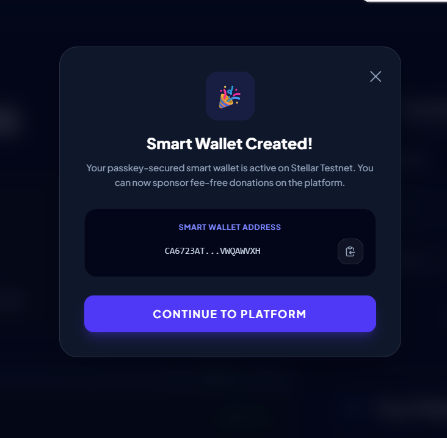
    </td>
  </tr>
</table>

The Smart Wallet Factory contract deploys a new smart contract wallet on Stellar Testnet, assigning the user a permanent on-chain address fully controlled by their passkey.

**5. Browsing the Campaign**

<table>
  <tr>
    <td align="center">
      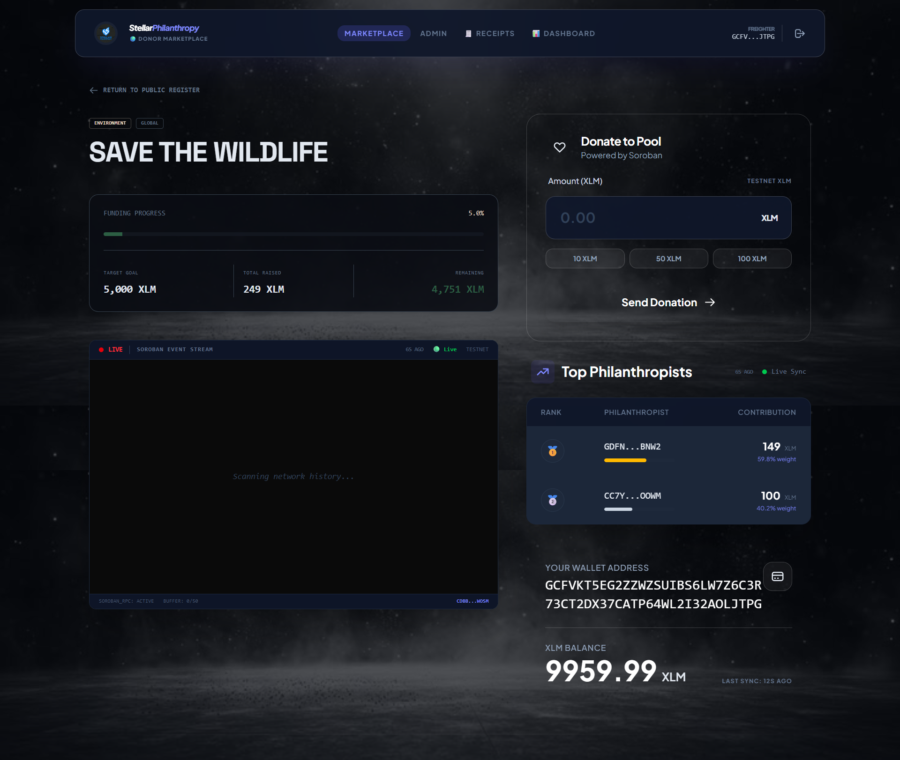
    </td>
  </tr>
</table>

Connected via `SMARTWALLET (PASSKEY)`, the user browses the "Save the Dams" campaign (goal: 10,000 XLM, raised: 18.8 XLM) with a sponsored test balance, ready to send a 50 XLM donation.

**6. Transaction Signing via Passkey**

<table>
  <tr>
    <td align="center">
      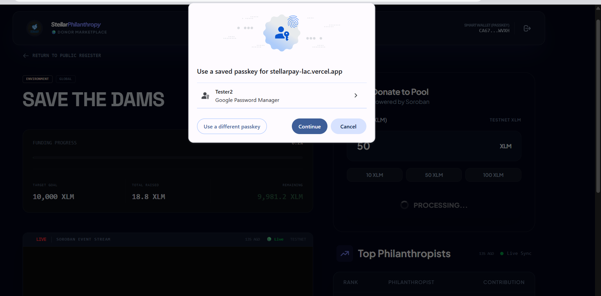
    </td>
  </tr>
</table>

Instead of a wallet-extension popup, the user gets a native "Use a saved passkey" browser prompt and authenticates with a fingerprint or Face ID to sign the contract invocation.

**7. Real-Time Ledger Updates & Gamification**

<table>
  <tr>
    <td align="center">
      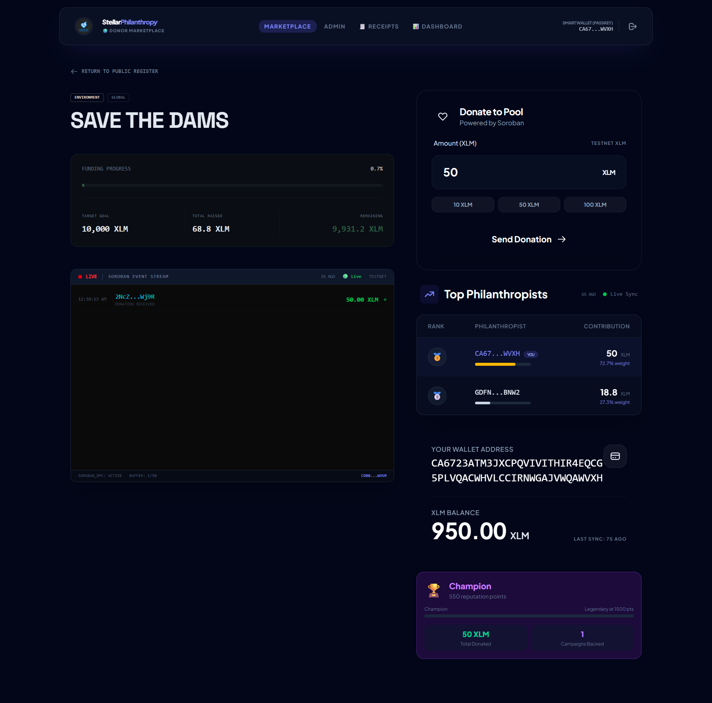
    </td>
  </tr>
</table>

The donation executes atomically on-chain and the UI updates instantly via Horizon SSE: total raised jumps from 18.8 to 68.8 XLM, a new event appears in the live Soroban Event Stream, the donor's wallet takes Rank #1 on the leaderboard at 72.7% contribution weight, and a **"Champion"** reputation badge (550 points) unlocks.

**8. Soul-Bound Impact Receipts**

<table>
  <tr>
    <td align="center">
      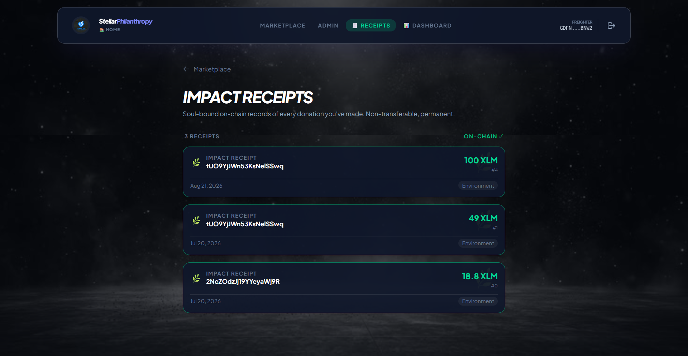
    </td>
  </tr>
</table>

In the "Receipts" tab, the donor sees their newly minted, non-transferable Impact Receipt (`Receipt ID: 2NcZODzJj19YYeyaWJ9R`) — permanent cryptographic proof of their contribution.

**9. The Admin Console**

<table>
  <tr>
    <td align="center">
      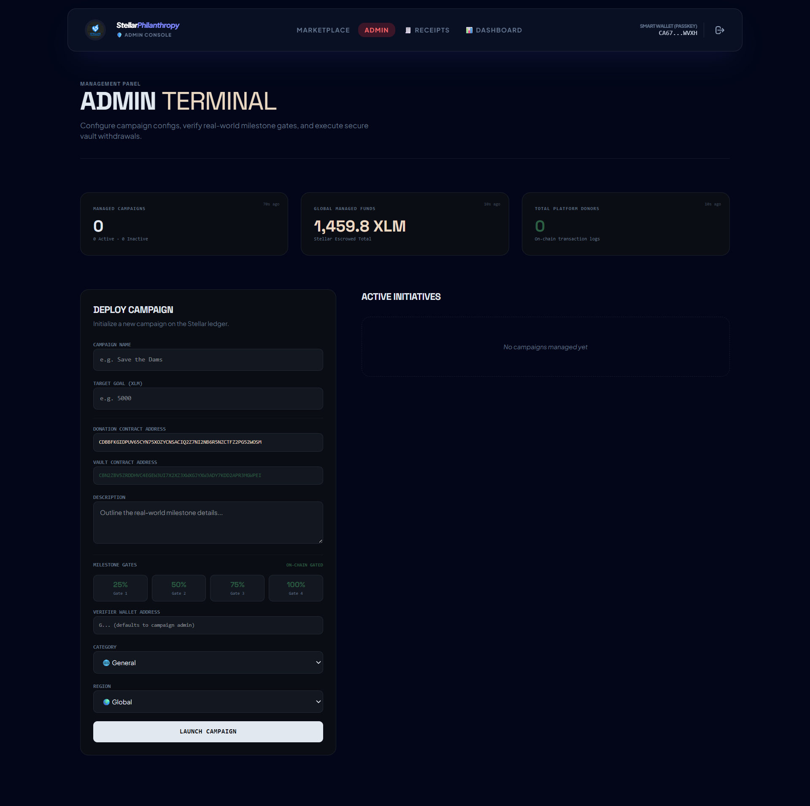
    </td>
  </tr>
</table>

Admins monitor global platform metrics (1,459.8 XLM managed across all campaigns) and deploy new initiatives from a clean, ledger-style form defining goal, milestone gates, and a verifier wallet address.

> ✅ **Level 5 Proof:** Gasless Passkey onboarding end-to-end, Smart Wallet Factory deployment, passkey-signed transaction, real-time SSE updates, gamified leaderboard & reputation badges, Soul-Bound Impact Receipts, and admin global metrics — all demonstrated on Stellar Testnet.

---

## 🌱 Level 5 — Growth, Onboarding & Product Iteration

### User Growth & Onboarding

The Level 5 requirement of **minimum 50 testnet users onboarded with real transaction activity** is met, verified on-chain via Stellar Expert:

1. **On-chain proof** — every user who chose "Quick Start (Smart Wallet)" triggers a real `deploy()` call against the Smart Wallet Factory contract, permanently visible on Stellar Expert.
2. **Off-chain proof** — a Google Form was used to collect each user's wallet address, email, name, and a product feedback rating, then exported to Excel for record-keeping.

| Onboarding Artifact | Link |
|---|---|
| 📝 Google Form (user details + feedback) | [Google Sheet — response export](https://docs.google.com/spreadsheets/d/1sx7-RLx74Km9cLnT1sIfsiBlsCqhcecrCjEyvzq91Rg/edit?usp=sharing) |
| 📥 Exported transaction activity (Stellar Expert) | `transactions-export-stellar-expert-2026-07-20T19-50-07.csv` + `transactions-export-stellar-expert-2026-07-20T19-50-15.csv` (included in repo — see [Real Transaction Activity](#real-transaction-activity)) |

### Real Transaction Activity

The attached Stellar Expert exports cover the full history of the `CDZL737THBVBCO443UXGXCFF4Z3JQNFAKRZXZNIPMF3FG4IDDTMDP6KP` (Smart Wallet Factory) contract, from its creation timestamp (**2026-07-17 08:03:25 UTC**) through **2026-07-20 19:27:22 UTC**, deduplicated by transaction hash:

| Metric | Count |
|---|---|
| Total unique testnet transactions | **55** |
| `deploy()` calls — new Passkey smart wallets created | **53** |
| Contract `initialize()` call | 1 |
| Contract creation (`created contract`) | 1 |
| **Unique destination wallet addresses from `deploy()`** | **53 — zero duplicates** |

This means **53 distinct real smart wallets were deployed on Testnet** through the Passkey onboarding flow — each one a real user who completed WebAuthn registration and received a working on-chain wallet, not a synthetic or seeded account. Checking the 53 deployed addresses for duplicates confirmed none repeat, so this is 53 unique users, clearing the 50-user requirement.

🔗 [View the Smart Wallet Factory contract on Stellar Expert](https://stellar.expert/explorer/testnet/contract/CDZL737THBVBCO443UXGXCFF4Z3JQNFAKRZXZNIPMF3FG4IDDTMDP6KP)

### Product Improvements & Feedback-Driven Roadmap

Based on responses collected through the onboarding Google Form, the protocol was actively evolved to resolve the top user pain points. Each fix below is traceable to a real, pushed commit.

#### 1. Wallet Integration Friction
- **User Feedback:** *"The requirement to create and connect a web3 wallet to perform donations is a significant technical hassle."*
- **Resolution:** Implemented **Gasless Passkey Smart Wallets** — users authenticate and create an on-chain wallet instantly using device-native biometrics (Face ID / Touch ID), with zero seed phrases and zero gas fees.
- **Implementation Commits:**
  - [`f6ec4a3`](https://github.com/debdeepadutta/stellarpay/commit/f6ec4a3) — WebAuthn native integration
  - [`1abea0e`](https://github.com/debdeepadutta/stellarpay/commit/1abea0e) — Passkey RP ID validation logic

#### 2. Campaign Management Controls
- **User Feedback:** *"Frustration regarding the inability to delete created campaigns and confusion when completed campaigns remain visible."*
- **Resolution:** Upgraded the **Admin Terminal** to support campaign deactivation and global status toggling, so only actively managed initiatives appear in the global marketplace.
- **Implementation Commits:**
  - [`c571448`](https://github.com/debdeepadutta/stellarpay/commit/c571448) — Admin portal and contract updates
  - [`e6b3e1a`](https://github.com/debdeepadutta/stellarpay/commit/e6b3e1a) — Admin UI stability guards

#### 3. Transparency & Trust Verification
- **User Feedback:** *"Strong demand for increased clarity regarding admin fund management and verification of campaign legitimacy to build trust."*
- **Resolution:** Redesigned the visual identity into **"The Living Ledger"** and overhauled the smart contract architecture to enforce **milestone-based fund releases** plus **Soul-Bound Impact Receipts (SBTs)** minted to every donor as verifiable proof of contribution.
- **Implementation Commits:**
  - [`03904f8`](https://github.com/debdeepadutta/stellarpay/commit/03904f8) — "Living Ledger" visual identity redesign
  - [`f603aa4`](https://github.com/debdeepadutta/stellarpay/commit/f603aa4) — Milestone-based fund release logic
  - [`6718f22`](https://github.com/debdeepadutta/stellarpay/commit/6718f22) & [`f0d0d6a`](https://github.com/debdeepadutta/stellarpay/commit/f0d0d6a) — Soul-Bound Token (SBT) impact receipts

**Phase 6 roadmap (planned, not yet shipped):**

1. **Decentralized Milestone Verification (Community DAO)** — Replace single-verifier milestone approval with donor voting. Admins upload milestone proof (photos/documents) to IPFS; donors holding the Soul-Bound Impact Receipt for that campaign get voting rights, and vault funds release only if a majority vote confirms the milestone was actually met.
2. **Fiat On-Ramps (SEP-24 / Stellar Anchors)** — Integrate a Stellar Anchor (e.g. MoonPay/MoneyGram) so Web2 users can donate via credit card or bank transfer, auto-converted to USDC and routed into the Soroban vault — combined with Passkeys, a Web3 dApp that feels like a Web2 GoFundMe.
3. **Yield-Bearing Charity Vaults (Soroban DeFi)** — While funds sit in escrow awaiting milestone completion, deploy idle XLM into a Soroban DeFi lending protocol (e.g. Blend) to earn yield. At milestone completion, principal goes to the charity and generated yield is either given as a charity bonus or returned to donors as a reward.
4. **Dynamic "Level-Up" Impact NFTs** — Evolve the current SBT receipt into a dynamic visual NFT (e.g. a sapling) whose on-chain metadata updates automatically as the campaign clears real-world milestones, so the NFT "grows" in the donor's wallet — built for social shareability.
5. **Automated Recurring "Streaming" Donations** — Let donors subscribe to a cause via their Smart Wallet, auto-streaming a fixed amount (e.g. 5 XLM/week), with a programmatic kill-switch that pauses all subscriptions automatically if the campaign misses its milestones.

> Native mobile biometric support was previously listed here but is not actually a gap — the current WebAuthn Passkey flow already uses the device's Face ID / fingerprint sensor via the mobile browser. It would only become relevant if a standalone native app or installed PWA is built later, since that would call OS-level biometric APIs directly instead of going through the browser's WebAuthn layer.

> Full raw responses are in the [Google Form export](https://docs.google.com/spreadsheets/d/1sx7-RLx74Km9cLnT1sIfsiBlsCqhcecrCjEyvzq91Rg/edit?usp=sharing) if you want to trace a specific quote back to a respondent.

### Product Presentation

| Deliverable | Link |
|---|---|
| 📊 Pitch Deck (Problem, Solution, Market, Architecture, Growth Strategy, Roadmap) | [View PDF](https://drive.google.com/file/d/124hZlms0_7vy7vqZgTcp-i4ulqXXTnWv/view?usp=sharing) |
| 🎬 Full Product Walkthrough / Demo Video | [Watch on Canva](https://canva.link/ml4qkgjho56hxwf) |

**Growth strategy & roadmap (summary — full detail in the pitch deck):**
- **Now:** Testnet validation with 53 verified unique real Passkey wallets, dual onboarding paths (extension wallet + smart wallet), gamified donor retention (leaderboard + reputation).
- **Next (Phase 6):** Decentralized milestone verification via donor DAO voting, fiat on-ramps via a Stellar Anchor (SEP-24), yield-bearing charity vaults through Soroban DeFi, dynamic "level-up" impact NFTs, and streaming recurring donations with a milestone-linked kill-switch. Full breakdown in [Product Improvements & Feedback-Driven Roadmap](#product-improvements--feedback-driven-roadmap).
- **Later:** Mainnet launch, verified-NGO onboarding pipeline, and a public transparency API so any campaign's fund flow can be audited by third parties without needing a wallet.

---

## 🧪 Test Results

### Rust Contract Tests (7 passing)

```
running 2 tests
test test::test_donation_flow                    ... ok
test test::test_top_donors                       ... ok
test result: ok. 2 passed; 0 failed; finished in 0.34s

running 5 tests
test test_edge_case_unauthorized_logger_call - should panic    ... ok
test test_edge_case_zero_donation - should panic               ... ok
test test_edge_case_unauthorized_vault_withdrawal - should panic... ok
test test_admin_functions                                      ... ok
test test_full_donation_flow_end_to_end                        ... ok
test result: ok. 5 passed; 0 failed; finished in 0.33s
```

### Vitest Frontend Tests (4 passing)

```
✓ Stellar Philanthropy DApp (4)
  ✓ renders the landing page initially
  ✓ connects the wallet and displays the truncated address in Navbar
  ✓ navigates to marketplace and shows campaigns placeholder
  ✓ navigates to admin portal and shows empty state

Test Files  1 passed (1)
     Tests  4 passed (4)
  Duration  3.60s
```

Run tests locally:

```bash
# Frontend tests
npm run test

# Contract tests
cd contracts && cargo test
cd logger_contract && cargo test
cd vault_contract && cargo test
```

---

## ⚙️ CI/CD Pipeline

Every push to `main` or `level-4-upgrade` triggers 4 automated jobs:

```
┌─────────────────────┐  ┌─────────────────────┐  ┌─────────────────────┐
│  Contract           │  │  Frontend           │  │  Security           │
│  Verification       │  │  Verification       │  │  Scan               │
│                     │  │                     │  │                     │
│  • Rust setup       │  │  • Node.js 20       │  │  • npm audit        │
│  • wasm32 target    │  │  • npm install      │  │  • No hardcoded     │
│  • cargo test (x3)  │  │  • vitest (4 tests) │  │    Firebase keys    │
│  • cargo build      │  │  • npm build        │  │                     │
└──────────┬──────────┘  └──────────┬──────────┘  └──────────┬──────────┘
           │                        │                         │
           └────────────────────────┴─────────────────────────┘
                                    │ all pass
                                    ▼
                        ┌─────────────────────┐
                        │  Production Deploy  │
                        │  (main only)        │
                        │  • Vercel deploy    │
                        └─────────────────────┘
```

---

## 🛠️ Tech Stack

| Layer | Technology |
|-------|-----------|
| **Frontend** | React 19 (Vite) |
| **Routing** | React Router DOM v7 |
| **Styling** | Tailwind CSS |
| **Blockchain SDK** | Stellar SDK |
| **Smart Contracts** | Soroban — Rust compiled to WASM |
| **Wallet Integration** | StellarWalletsKit (Freighter, xBull, Albedo) |
| **Gasless Onboarding** | WebAuthn Passkeys + Smart Wallet Factory contract |
| **Database** | Firebase Firestore |
| **Real-time** | Horizon SSE EventSource |
| **Testing** | Vitest (frontend) + Rust cargo test (contracts) |
| **CI/CD** | GitHub Actions |
| **Deployment** | Vercel |

---

## ⚙️ Setup Instructions

### 1. Clone the Repository

```bash
git clone https://github.com/debdeepadutta/stellarpay.git
cd stellarpay
```

### 2. Install Dependencies

```bash
npm install
```

### 3. Configure Environment Variables

Create a `.env` file in the root:

```env
VITE_FIREBASE_API_KEY=your_api_key
VITE_FIREBASE_AUTH_DOMAIN=your_auth_domain
VITE_FIREBASE_PROJECT_ID=your_project_id
VITE_FIREBASE_STORAGE_BUCKET=your_storage_bucket
VITE_FIREBASE_MESSAGING_SENDER_ID=your_sender_id
VITE_FIREBASE_APP_ID=your_app_id
```

### 4. Run Locally

```bash
npm run dev
```

### 5. Run Tests

```bash
npm run test
```

### 6. Prerequisites

- ✅ [Freighter](https://freighter.app/), [xBull](https://xbull.app/), or [Albedo](https://albedo.link/) wallet installed — **or** use "Quick Start (Smart Wallet)" for a passkey-only flow with no extension required
- ✅ Wallet set to **Stellar Testnet**
- ✅ Wallet funded via [Stellar Friendbot](https://friendbot.stellar.org/) (Smart Wallet users are auto-credited a sponsored test balance)

---

## 📁 Project Structure

```
stellarpay/
├── contracts/                         # Donation Contract (Rust/Soroban)
│   └── src/
│       ├── lib.rs                     # create_campaign, donate, get_campaign_info
│       └── test.rs                    # Rust unit tests (2 passing)
│   └── tests/
│       └── integration_test.rs        # Rust integration tests (5 passing)
├── logger_contract/                   # Logger Contract (Rust/Soroban)
│   └── src/lib.rs                     # log_donation, get_history, get_recent
├── vault_contract/                    # Vault Contract (Rust/Soroban)
│   └── src/lib.rs                     # deposit, withdraw, get_campaign_stats
├── sbt_contract/                      # SBT / Impact Receipt Contract (Rust/Soroban)
│   └── src/lib.rs                     # mint_receipt, get_receipt, get_receipts_by_donor
├── smart_wallet_factory/              # Smart Wallet Factory Contract (Rust/Soroban)
│   └── src/lib.rs                     # deploy, initialize, get_wallet_by_passkey
├── src/
│   ├── pages/
│   │   ├── Landing.jsx                # Portal selection (Admin / Donor)
│   │   ├── AdminPortal.jsx            # Campaign creation & management
│   │   ├── DonorMarketplace.jsx       # Browse all campaigns
│   │   └── CampaignDetails.jsx        # Campaign page with donate + leaderboard
│   ├── components/
│   │   ├── AdminPanel.jsx             # Vault controls per campaign
│   │   ├── AnalyticsDashboard.jsx     # Charts & donation stats
│   │   ├── DonorLeaderboard.jsx       # Top philanthropists ranking
│   │   ├── LiveDonationFeed.jsx       # Horizon SSE real-time feed
│   │   ├── Navbar.jsx                 # Navigation + wallet status
│   │   ├── RecentLogs.jsx             # Logger contract events
│   │   ├── SendXLMForm.jsx            # Donation input form
│   │   ├── TopDonors.jsx              # Top donors widget
│   │   ├── TransactionStatus.jsx      # Tx status indicator
│   │   ├── VaultStats.jsx             # Vault balance display
│   │   ├── WalletCard.jsx             # Connected wallet info
│   │   ├── PasskeyOnboarding.jsx      # Passkey / Smart Wallet onboarding modal
│   │   ├── ImpactReceipts.jsx         # Soul-Bound Receipt gallery
│   │   └── ReputationBadge.jsx        # Gamified badge display
│   ├── assets/
│   │   └── logo.png                   # Stellar Philanthropy logo
│   ├── firebase.js                    # Firebase Firestore config
│   └── App.jsx                        # Router + contract constants
├── .github/workflows/ci.yml           # GitHub Actions pipeline
├── level_1_screenshots/               # Level 1 proof
├── level_2_screenshots/               # Level 2 proof
├── level_3_screenshots/               # Level 3 proof
├── level_4_screenshots/               # Level 4 proof
├── level_5_screenshots/               # Level 5 proof
│   ├── ss1.png                        # Onboarding gateway
│   ├── ss2.png                        # Passkey account creation
│   ├── ss3.png                        # WebAuthn passkey registration
│   ├── ss4.png                        # Smart wallet instantiated
│   ├── ss5.png                        # Browsing campaign (smart wallet connected)
│   ├── ss6.png                        # Passkey transaction signing
│   ├── ss7.png                        # Real-time updates + gamification
│   ├── ss8.png                        # Soul-bound impact receipts
│   └── ss9.png                        # Admin console / global metrics
├── transactions-export-stellar-expert-2026-07-20T17-34-47.xls   # Level 5 real transaction proof
├── contract_deployment_summary.txt    # Deployed contract addresses
└── README.md
```


---

## 📌 Challenge Journey

| Level | Focus | Key Deliverable |
|-------|-------|----------------|
| **Level 1** | Foundation | Freighter wallet + XLM send/receive on Testnet |
| **Level 2** | Smart Contracts | Soroban donation contract + multi-wallet support |
| **Level 3** | Quality & Polish | 4 unit tests, localStorage caching, UX improvements |
| **Level 4** | Production Protocol | 3-contract ecosystem, dual portals, Firebase marketplace, CI/CD |
| **Level 5** | Growth & Iteration | Passkey onboarding, SBT receipts, 53 verified unique testnet wallets, feedback-driven roadmap, pitch deck |

---

## ✅ Submission Checklist

| Requirement | Status | Link |
|---|---|---|
| Public GitHub repository | ✅ | [github.com/debdeepadutta/stellarpay](https://github.com/debdeepadutta/stellarpay) |
| Minimum 20+ meaningful commits | ✅ 50+ commits verified via `git log` | [Commit history](https://github.com/debdeepadutta/stellarpay/commits/main) |
| Live deployed application | ✅ | [stellarpay-lac.vercel.app](https://stellarpay-lac.vercel.app/) |
| PPT / Pitch deck link | ✅ | [Pitch Deck PDF](https://drive.google.com/file/d/124hZlms0_7vy7vqZgTcp-i4ulqXXTnWv/view?usp=sharing) |
| Demo video link | ✅ | [Level 5 Demo (Canva)](https://canva.link/ml4qkgjho56hxwf) |
| Proof of 50+ users | ✅ 53 unique wallets deployed on-chain (verified, zero duplicates) | [Real Transaction Activity](#real-transaction-activity), [Smart Wallet Factory on Stellar Expert](https://stellar.expert/explorer/testnet/contract/CDZL737THBVBCO443UXGXCFF4Z3JQNFAKRZXZNIPMF3FG4IDDTMDP6KP) |
| Screenshots of analytics / transaction activity | ✅ | [`level_5_screenshots/`](#-level-5--passkey-onboarding-impact-receipts--growth), [transaction export](#real-transaction-activity) |
| Updated README and documentation | ✅ | This file |
| User feedback iteration summary | ✅ | [Future Evolution & User Feedback Implementations](#product-improvements--feedback-driven-roadmap) |

---

## 🙌 Author

**Debdeepa Dutta**

[](https://github.com/debdeepadutta)

---

<div align="center">
  <sub>Built with ❤️ on the Stellar Blockchain · Stellar Developer Program</sub>
</div>
